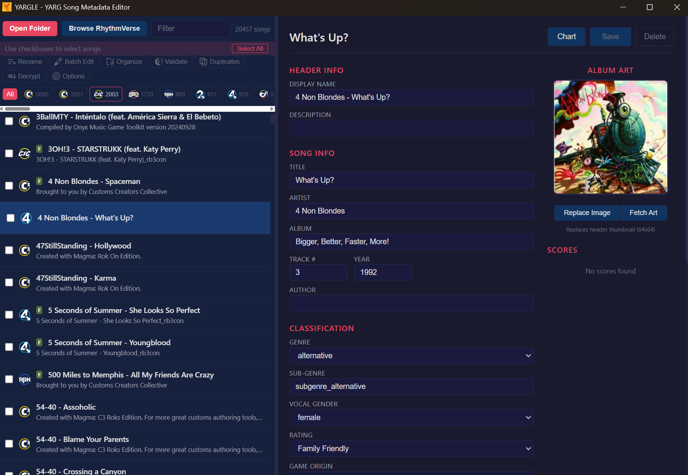

# YARGLE

**YARG Library Editor** — a Windows desktop app for managing custom-song libraries for [YARG](https://yarg.in/) (Yet Another Rhythm Game) and other Rock Band–style rhythm games.



YARGLE understands both formats a custom-song library contains:

- **Xbox 360 CON/STFS packages** (`*_rb3con` and friends) — read and edited in place with a custom STFS implementation that preserves the original block/hash layout
- **Unpacked song folders** (`song.ini` + `notes.mid`/`notes.chart` + audio + art)

Both flow through the same editor, so one library with mixed content is handled uniformly.

## Features

### Metadata editing
- Edit song info (title, artist, album, year, genre, difficulty ranks, rating, source icon, …) for CON files (`songs.dta`) and song folders (`song.ini`)
- Edit package display name, description, and thumbnail
- Fetch album art from iTunes / MusicBrainz Cover Art Archive
- Round-trip DTA parser that preserves formatting and comments

### Library tools
- **Fast scans of huge libraries** — a persistent scan cache means a 20k-song library on an external drive loads in seconds after the first scan
- **Batch edit** metadata across a selection or the whole library
- **Batch rename** files from metadata patterns
- **Auto-organize** into Artist/Album folder structures
- **Validator** — catches missing/invalid metadata that can make YARG skip or misidentify songs, with one-click and batch fixes
- **Duplicate finder**
- **MOGG decryption** (via [themethod3](https://github.com/DarkRTA/themethod3))
- **Chart preview** — per-instrument note counts, density graphs, and a note-highway view parsed straight from the MIDI
- **YARG score sync** between stable and nightly, plus per-song score history

### RhythmVerse integration
- Browse and search [RhythmVerse](https://rhythmverse.co/) without leaving the app — newest uploads first, with per-file instrument coverage, uploader, upload date, size, and download counts
- One-click download straight into your library (zips and loose CON files), with automatic ingest
- Tracks what you've downloaded and flags songs that received an **update** on RhythmVerse since you fetched them — one click re-downloads and replaces
- "In library" badges so you can see at a glance what you already have
- Externally hosted files (Google Drive, Mediafire, …) open in your browser

### Quality of life
- Resizable panes, virtualized list for large libraries, multi-select with checkboxes
- Built-in update check against GitHub Releases (notify-only banner)

## Install

Grab `yargle.exe` from the [latest release](https://github.com/djrobson5/YARGLE/releases/latest) and run it. Windows only for now.

## Building from source

Prerequisites: [Rust](https://rustup.rs/) (stable) and [Node.js](https://nodejs.org/).

```bash
npm install
npm run tauri dev     # development build with hot reload
npm run tauri build   # release build -> src-tauri/target/release/yargle.exe
```

Stack: [Tauri 2](https://tauri.app/) (Rust backend), React 19 + TypeScript + Vite frontend.

## License

[MIT](LICENSE)

## Notes & credits

- Not affiliated with YARG, RhythmVerse, Harmonix, or Microsoft.
- RhythmVerse integration uses the site's public endpoints politely (single downloads, honest User-Agent). RhythmVerse indexes freely shared, legal custom charts — support them at [rhythmverse.co](https://rhythmverse.co/).
- MOGG decryption by [DarkRTA/themethod3](https://github.com/DarkRTA/themethod3); texture decoding via [texture2ddecoder](https://crates.io/crates/texture2ddecoder); MIDI parsing via [midly](https://crates.io/crates/midly).
- Thanks to the C3 / customs community for two decades of keeping plastic guitars alive.
